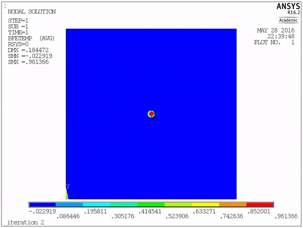

# Introduction
This is a example demonstarting implementation of a phase field model into ANSYS using the macro. This approach is not computationally efficient but it does the job and the implementation is very simple. For simplicity, the phase field model here operates only with one order parameter and the transformation strain is modelled through the thermal coefficients. 



*Growth of a single martensitic variant in an austenitic matrix*

## Phase Field Model
The program minimizes the following energy functional:


withing the Ginzburg-Landau theory:
```
\frac{\partial \phi}{\partial t} = -\mathcal{M} \frac{\delta \Psi}{\delta \phi}
```

which gives the following equations:


These equations are solved together with the equations of mechanical equilibrium at each time step:


## Implementation into ANSYS using APDL macro

## Solution

## Limitations
